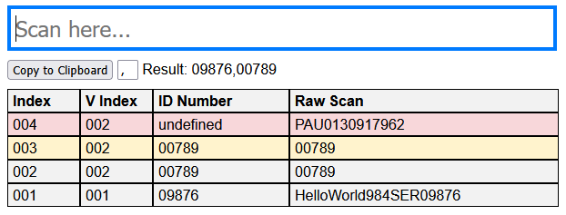

# Scan Me App

## Welches Problem löst die App?
Die App wurde ursprünglich entwickelt um die QR-Codes (Id-Nummern) auf den `Elbit`-Paketen zu scannen und einen kopierbaren Text zu generieren, der im `Abas` eingelesen werden kann. Dies erleichtert das Erstellen des Liefernscheins enorm.

## Wie benutze ich die App?
1. Lade dir die Dateien in diesem Repo herunter
2. Starte die App indem du das `index.html` file öffnest (doppelklick)
3. Klicke in das `Scan here...` Feld (wird beim Starten automatisch fokussiert)
4. Scanne deine Artikel
5. Überprüfe, ob alle ID-Nummern korrekt interpretiert wurden (Spalte `ID Number`)
6. Kopiere die zusammengehängte Zeichenkette (`Copy to Clipboard`)
7. Füge die Zeichenkette im `Abas` ein, um den Lieferschein zu erstellen

> [!CAUTION]
> Alle gescannten Daten werden nur 'in memory' gespeichert und gehen beim Schliessen oder Neuladen der Seite verloren!
> Dem kann vorgebeugt werden, indem ein Zwischenresultat in eine Textdatei (oder Abas) kopiert wird.

## Einstellmöglichkeiten
#### Trennzeichen (Delimiter)
Rechts neben dem `Copy to Clipboard` Knopf befindet sich ein kleines Textfeld, indem ein Zeichen (Text) festgelegt werden kann, das als Trenner zwischen den gescanten Werten eingesetzt wird.

## Funktionsweise der App

#### Scan Here Feld
Nimmt die Daten des Scanners entgegen und speichert diesen Wert automatisch, wenn für eine kurze Zeit keine Eingabe gemacht wird.

#### Copy to Clipboard Button
Kopiert den rechts dargestellten Text in die Zwischenablage. Kann mit `CTRL + V` eingefügt werden.

#### Tabelle Spalten

| Key | Beschreibung |
| --- | --- |
| Index | Die Nummer des Scans (wird fortlaufend hochgezählt) |
| V Index | Validierter Index (wird nur hochgezählt, wenn eine valide Id Nummer interpretiert werden konnte) |
| ID Number | Die Id Nummer, die vom Scan interpretiert wurde |
| Raw Scan | Die rohen Daten, so wie sie der Scanner ausgegeben hat |

#### Tabelle Farben
| Farbe | Bedeutung |
| --- | --- |
| Gelb | Duplikat, eine Id existiert in der Tabelle doppelt |
| Rot | Fehler, beim interpretieren der gescannten Daten ist etwas schief gelaufen |

## Tipps und Tricks

#### Logs
Manchmal hilft es die Funktionsweise der App besser zu verstehen, wenn man sich die Logs in den Entwicklertools (`F12`) ansieht.

## Du siehst Entwicklungsbedarf?
Wenn du einen Fehler gefunden hast oder findest, dass sich die App noch verbessern/weiterentwickeln kann, dann zögere nicht ein Issue zu erstellen oder selbst Hand anzulegen und einen PullRequest zu eröffnen.  
Über konstruktive Kritik und Verbesserungsvorschläge würde ich mich sehr freuen :)